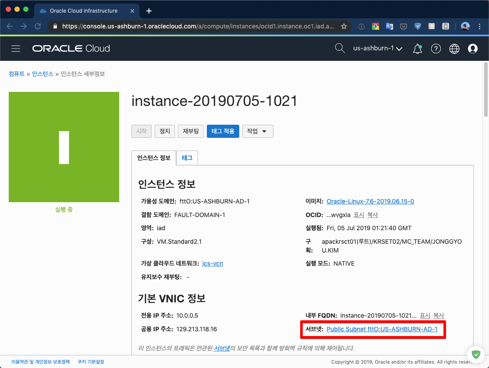
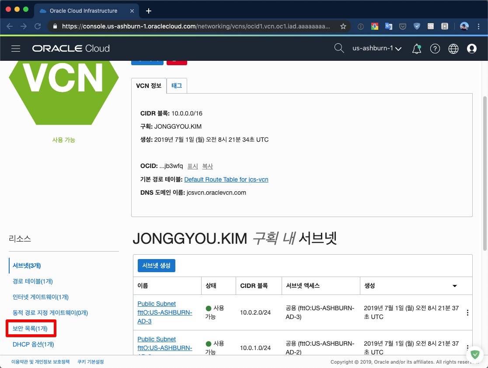
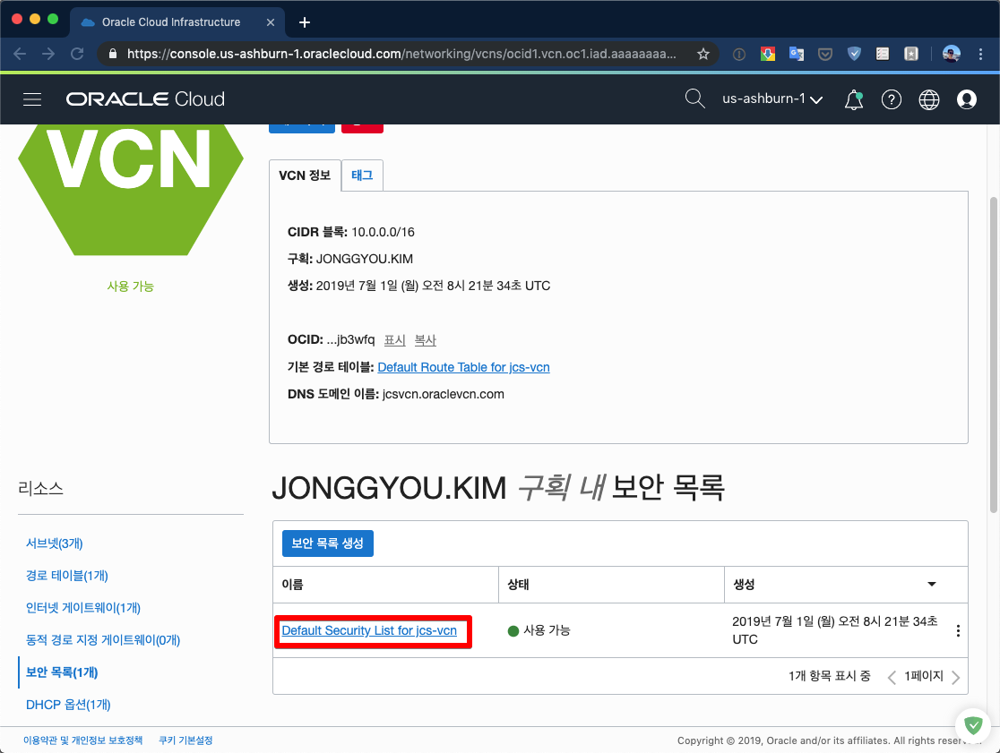
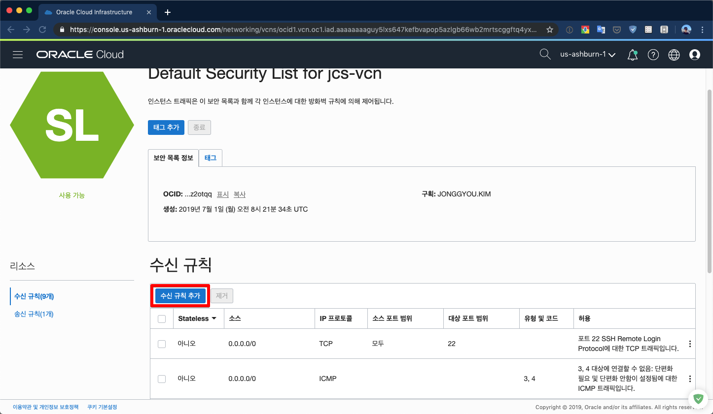
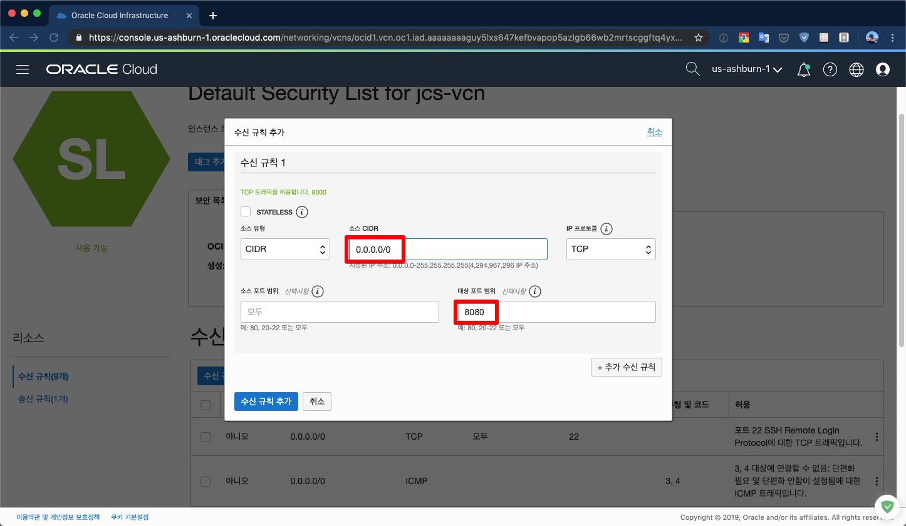
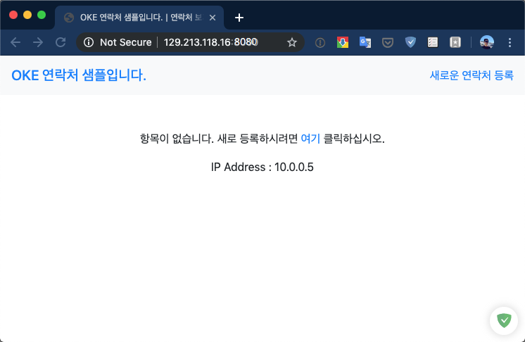
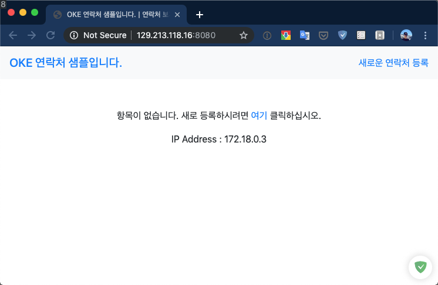

# 애플리케이션 작성

Node.JS로 만들어진 사용자를 관리하는 애플리케이션을 작성해 보도록 합니다. 이 애플리케이션은 MySQL에 새로운 유저와 테이블을 사용합니다.

## 소스 가져오기

애플리케이션의 소스는 미리 만들어진 것을 가져와서 사용하고, MySQL은 미리 만들어진 도커 이미지를 사용합니다.

1. git 클라이언트를 설치합니다.

    ~~~
    sudo yum install -y git
    ~~~

1. git 에서 기존에 만들어진 애플리케이션 소스를 가져옵니다.

    ~~~
    cd
    git clone https://github.com/{아이디}/cloud-native-oke
    ~~~

    sample-app 디렉토리로 이동을 합니다.
    ~~~
    cd cloud-native-oke
    ~~~

## 데이터베이스 시작

>**다른 데이터베이스를 사용한다면 건너뛰기**

1. 포트 열기

    ~~~sh
    sudo firewall-cmd --add-port=3306/tcp --permanent
    sudo systemctl restart firewalld
    ~~~

1. MySQL 컨테이너 실행하기

    ~~~
    docker run --name mydb -e MYSQL_ROOT_PASSWORD=mypassword -p 3306:3306 -d mysql:5.7 
    ~~~

1. 애플리케이션용 테이블 만들기

    ~~~sh
    cat create.sql | docker exec -i mydb mysql -u root -pmypassword
    #exit
    ~~~

## 애플리케이션 시작

1. 포트 열기

    ~~~sh
    sudo firewall-cmd --add-port=8080/tcp --permanent
    sudo systemctl restart firewalld
    ~~~
    
1. npm 설치

    ~~~
    sudo yum -y install npm
    ~~~

1. 환경설정하기

    해당 애플리케이션은 MySQL에 접속하기 위해서 환경변수가 필요합니다.  
    미리 기동해 놓은 mysql에 대한 설정을 합니다.
    ~~~sh
    export MYSQL_SERVICE_HOST=129.213.149.203
    export MYSQL_SERVICE_USER=test
    export MYSQL_SERVICE_PASSWORD=Welcome1
    export MYSQL_SERVICE_DATABASE=sample
    ~~~

1. 애플리케이션 실행하기

    ~~~sh
    npm install
    npm start
    ~~~

1. 다른 창을 열어 curl로 체크합니다.
    ~~~
    curl localhost:8080
    ~~~

1. **compute instance로 수행**하였다면 해당 포트에 대한 Security List 도 등록한다. (** :star: :star2: 미리 설정했다면 건너뛰기**)

    

    

    

    

    

1. 테스트 하기

    웹브라우저로 `http://호스트IP:8080/`을 접속해 봅니다.

    

    표시되는 IP Address가 현재 VM의 IP Address를 나타내고 있습니다.

1. 마치기

    테스트가 잘 되면 Ctrl-C 를 눌러 서비스를 마칩니다.

# 애플리케이션을 도커 이미지로 만들기

위에서 만든 애플리케이션을 도커이미지로 만들는 과정입니다.
도커이미지를 만들기 위해서 Dockerfile 이 필요하며 미리 생성되어 있습니다.

1. Dockerfile 살펴보기

    **cloud-native-oke** 디렉토리 내에 Dockerfile 이 있습니다.  
    이 파일은 도커 이미지를 만들기 위한 설정파일입니다.
    ~~~docker
    # Node 버젼 8의 이미지를 기본으로 합니다.
    FROM node:alpine

    # 애플리케이션이 위치할 디렉토리를 생성합니다.
    WORKDIR /user/src/app

    # npm을 이용하여 필요한 패키지를 설치합니다.
    COPY package*.json ./
    RUN npm install

    # 모든 애플리케이션 파일을 복사합니다.
    COPY . .

    # 포트를 익스포즈 합니다.
    EXPOSE 8080

    # 애플리케이션를 실행합니다.
    CMD ["npm", "start"]
    ~~~

1. 도커 이미지 만들기
    ~~~sh
    cd cloud-native-oke
    sudo docker build -t sample-app .
    ~~~

    다음과 같이 도커 이미지가 만들어집니다.
    ~~~sh
    # 도커 이미지 만들기
    sudo docker build -t sample-app .

    Sending build context to Docker daemon  2.099MB
    Step 1/7 : FROM node:8
    ---> 4f01e5319662
    Step 2/7 : WORKDIR /user/src/app
    ---> Running in ba981429b55c
    Removing intermediate container ba981429b55c
    ---> cbb9451c4e29
    Step 3/7 : COPY package*.json ./
    ---> 902f1f20f4bc
    Step 4/7 : RUN npm install
    ---> Running in c0d2a804a56b
    ...
    ~~~

1. 이미지 확인하기

    만들어진 도커 이미지를 확인하기 위하여 다음의 명령을 내립니다.

    ~~~sh
    sudo docker images
    ~~~

    다음과 같이 sample-app 이 만들어져 있음을 알 수 있습니다.
    ~~~sh
    # 도커 이미지 확인하기
    docker images
    
    REPOSITORY           TAG                 IMAGE ID            CREATED              SIZE
    sample-app           latest              7f88f43f85c9        About a minute ago   904MB
    mysql                5.7                 e47e309f72c8        2 weeks ago          372MB
    node                 8                   4f01e5319662        2 weeks ago          893MB
    tomcat               8.0                 ef6a7c98d192        5 months ago         356MB
    ~~~

# 애플리케이션을 컨테이너에서 수행하기

앞서 만든 애플리케이션 이미지를 사용하여 컨테이너를 실행해 보도록 합니다.

    
1. 애플리케이션 실행하기

    최종적으로  다음과 같이 애플리케이션을 실행합니다.
    ~~~
    sudo docker run --name app  -e MYSQL_SERVICE_HOST=129.213.149.203 -e MYSQL_SERVICE_USER=test -e MYSQL_SERVICE_PASSWORD=Welcome1 -e MYSQL_SERVICE_DATABASE=sample  -p 8080:8080 -it sample-app
    ~~~

    1. 옵션설정 : 필요한 환경변수 대입하기

        이 애플리케이션은 필요한 환경변수 `MYSQL_SERVICE_HOST`가 있습니다. 이 환경변수는 mysql 이 서비스 되고 있는 호스트를 나타낸니다. 설정하지 않으면 `localhost`로 대입되어 해당 애플리케이션 이미지에는 mysql이 존재하지 않아 애플리케이션이 동작하지 않습니다. 여기에서는 mysql 이 mydb 라는 이름의 컨테이너로 수행되기에 mydb라고 명명합니다.

        도커에서 환경변수의 값은 `-e` 옵션을 사용하여 대입합니다.
        ~~~
        -e MYSQL_SERVICE_HOST=mydb
        ~~~

        여러개의 환경변수는 -e 를 계속 반복해 줍니다.
        ~~~
        -e MYSQL_SERVICE_HOST=129.213.149.203 -e MYSQL_SERVICE_USER=test -e MYSQL_SERVICE_PASSWORD=Welcome1 -e MYSQL_SERVICE_DATABASE=sample 
        ~~~

    1. 옵션설정 : 포트 포워딩

        해당 애프리케이션은 8000 포트로 서비스 됩니다. 그래서 같은 포트로 포워딩 하기위해 다음과 같은 옵션을 사용합니다. 앞의 8000 은 호스트의 포트이고, 뒤의 8000은 컨테이너의 포트입니다.
        ~~~
        -p 8080:8080
        ~~~
        
    1. 옵션설정 : 도커와 터미널 상호작용

        -it 옵션을 주어 컨테이너에서 나오는 로그를 출력하고 입력을 할 수 있게 합니다.
        ~~~
        -it
        ~~~

1. 테스트 하기

    웹브라우저로 `http://호스트:8080/`을 접속해 봅니다.

    
    이전에 애플리케이션으로 수행한 화면과 동일하지만, 표시되는 IP Address가 VM의 IP Address가 아닌 컨테이너의 IP Address를 나타내고 있습니다.

    

    표시되는 IP Address가 현재 VM의 IP Address를 나타내고 있습니다.

    이로써 애플리케이션을 도커이미지로 만들고, 컨테이너로 수행완료하였습니다.  

---
완료하셨습니다.
