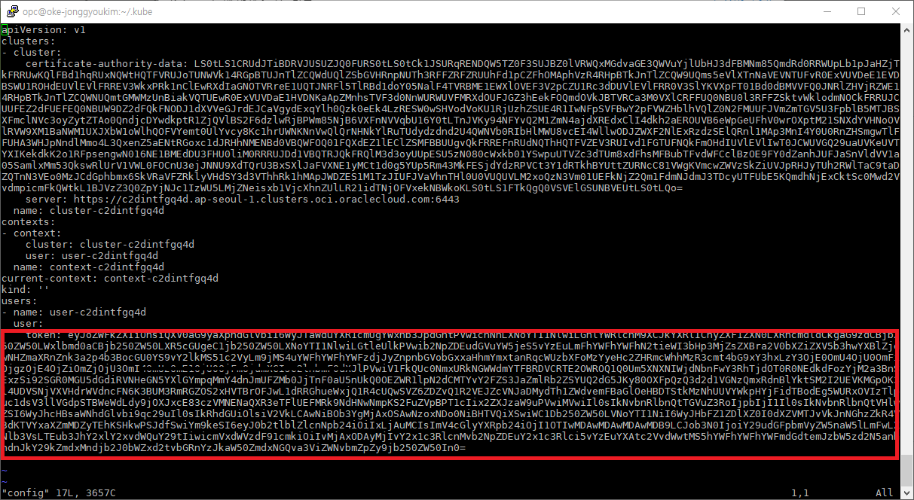

# Wercker 생성

오라클 컨테이너 기반 CI(Continuous Integration) 서비스인 Wercker를 사용하여 컨테이너 이미지 빌드, 테스트와 쿠버네티스 환경에 배포를 자동화하는 시나리오입니다.

Wercker 계정에 로그인을 합니다. 계정이 없다면 생성을 위해 app.wercker.com에 접속한 후 우측 Sign up 을 클릭합니다.

가입이 성공하면 로그인을 합니다.

Wercker에서는 하나의 Github Repository에 대응되는 단위를 애플리케이션이라 하며, Wercker 애플리케이션은 Step, Pipeline, Workflow를 포함합니다.  
먼저 Wercker 애플리케이션을 하나 생성합니다.

1. Create your first application 클릭

    

1. 좀 전에 가입한 GitHub을 선택하고 Next를 누릅니다.  
화면에서 **cloud-native-oke** 라는 이름의 repository를 선택하고 Next를 누릅니다.

    

1. SSH key는 public으로 할 것이니 기본적으로 선택된 사항으로 Next 를 누릅니다.

    

1. 전체적인 항목을 보고 "Create"를 눌러 애플리케이션을 생성합니다.

    

# 환경변수 설정

Wercker Application에서 **Oracle Container Registry** 에 컨테이너 이미지를 푸시하기 위한 설정을 합니다. 상단 탭 메뉴중에서 **Environment**를 선택합니다.

여기서 필요한 Key와 Value는 다음과 같습니다. 

1. OCI_AUTH_TOKEN
1. DOCKER_REGISTRY
1. DOCKER_USERNAME
1. DOCKER_REPO
1. KUBERNETES_MASTER
1. KUBERNETES_AUTH_TOKEN
1. KUBERNETES_NAMESPACE
    

> 여기서 KUBERNETES_MASTER와 KUBERNETES_AUTH_TOKEN은 $HOME/.kube/config (kubeconfig) 파일의 내용을 참조해서 설정합니다.

1. OCI_AUTH_TOKEN

    OCI Console 우측 상단의 사용자 아이디를 클릭 후 좌측 **Auth Tokens**를 선택한 후 **Generate Token**을 클릭합니다.
    
    
    
    DESCRIPTION에 임의로 **Wercker Token**이라고 입력한 후 **Generate Token** 버튼을 클릭합니다.

    
    
    생성된 토큰을 복사한 후 Wercker에 다음과 같이 입력하고 Add 버튼을 클릭합니다.

    **Key:** OCI_AUTH_TOKEN  
    **Value:** 토큰값 (예: 8K2}JTG96[d82{XXVWRq)

    
    
1. DOCKER_REGISTRY

    여기서는 애슈번(Ashburn) 리전에 있는 Registry를 사용하도록 하겠습니다.

    **Key:** DOCKER_REGISTRY  
    **Value:** 지역.ocir.io (예: iad.ocir.io)

    > Container Registry는 각 리전별로 존재합니다. Registry는 리전키 + ocir.io로 구성되는데, 리전키의 경우는 현재 icn(서울), nrt(도쿄), yyz(토론토), fra(프랑크푸르트), lhr(런던), iad(애쉬번), phx(피닉스)입니다. 

    
    
1. DOCKER_USERNAME

    Docker Username은 OCI 사용자 아이디입니다. OCI Console 우측 상단의 사람 아이콘을 클릭해서 확인할 수 있습니다. 

    

    여기에 Tenancy명이 필요합니다. 아래 Value는 예시이며, 보통 다음과 같이 구성됩니다.

    **Key:** DOCKER_USERNAME  
    **Value:** 태넌시명/아이디 (예: my_tenancy/jonggyou.kim@oracle.com)

    

1. DOCKER_REPO
    
    Docker Repository이름으로 {Tenancy의 Object Storage Namespace} + {레파지토리명}입니다. 다음과 같이 레파지토리 이름을 지정합니다. Tenancy의 Object Storage는 Tenancy 정보 페이지 하단에서 확인할 수 있습니다. (일반적으로 Tenancy 이름과 같습니다.)

    
    
    >**!!! Repository는 Tenancy에서 공통으로 사용하기 때문에 각자 레파지토리 이름이 달라야 하므로, 영문 이니셜을 뒤에 붙입니다.**

    **Key:** DOCKER_REPO  
    **Value:** 태넌시/특정이름 (예: my_tenancy/cloud-native-oke-jonggyoukim)

    

1. KUBERNETES_MASTER는 $HOME/.kube/config 파일에서 얻을 수 있습니다. 해당 파일을 편집기등으로 오픈한 후 MASTER 서버 주소를 복사 후 입력합니다.

    

    **Key:** KUBERNETES_MASTER  
    **Value:**: KUBERNETES SERVER MASTER URL (예: https://c2daobzgnrd.us-ashburn-1.clusters.oci.oraclecloud.com:6443)

    

1. KUBERNETES_AUTH_TOKEN도 마찬가지로 .kube/config 파일에서 얻을 수 있습니다. 해당 파일을 편집기등으로 오픈한 후 AUTH TOKEN을 복사해서 입력합니다. (한줄로 만들어야 합니다.)

    

    **Key:** KUBERNETES_AUTH_TOKEN  
    **Value:**: KUBERNETES AUTH TOKEN (예: LS0tLS1CRUdJTiBDRVJUSU.....)

    

1. KUBERNETES_NAMESPACE를 사용하는 이유는 동일한 서비스를 여러 사람이 동일한 노드에 배포하기 때문에 각 Pod와 Deployment, Service를 각 사용자별로 생성하기 위함입니다. Kubernetes Cluster에 Namespace를 지정하여 Pod, Service, Deployment, Secret을 분리합니다. 

    **Key:** KUBERNETES_NAMESPACE  
    **Value:**: 고유한 값 (예: jonggyoukim)

    

# 파이프라인 생성

