# OCI (Oracle Cloud Infrastructure) 시작하기
1. 브라우저에서 Oracle Cloud Infrastructure에 로그인하기 위해 제공 한 URL로 이동하십시오. (예: https://console.us-ashburn-1.oraclecloud.com/)

   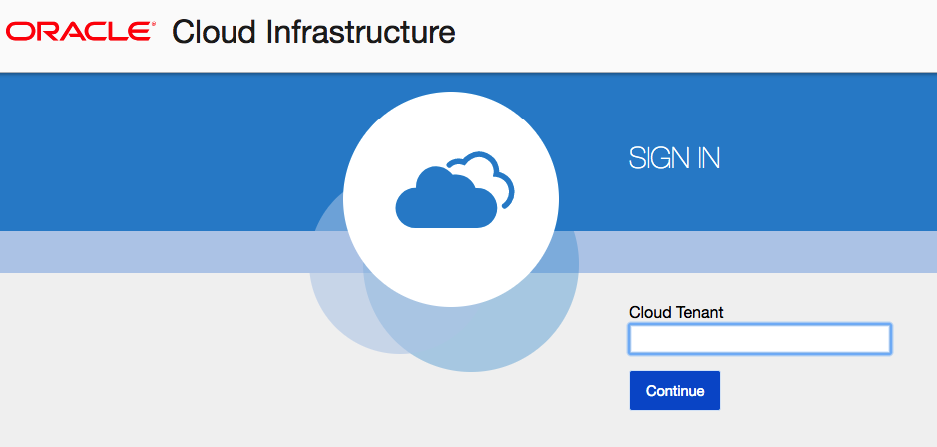

1. Tenant명에는 제공된 명을 입력합니다.

   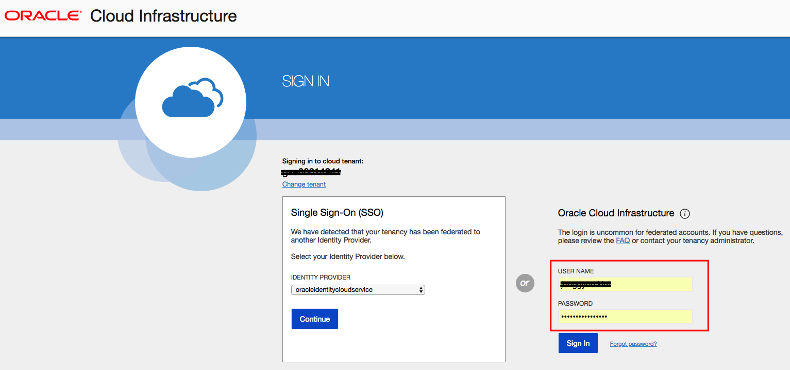

1. 클러스터를 만들 수있는 적절한 권한이있는 임차인을 지정하십시오. 다음 권한 중 하나를 사용하여 이러한 사용 권한을 상속합니다.
    - 임차인의 관리자 그룹에 속함
    - 정책이 Kubernetes 사용 권한을위한 적절한 컨테이너 엔진과 VCN_READ 및 SUBNET_READ 네트워킹 사용 권한을 부여하는 다른 그룹에 속함
1. 사용자 이름과 암호를 입력하십시오.

# 리소스 제어권한 부여하기
Kubernetes를 설정하기 위해서는 권한을 부여해야 합니다.

1. 왼쪽 상위의 MENU를 누르고 Identy 항목의 Policies 를 선택합니다.

   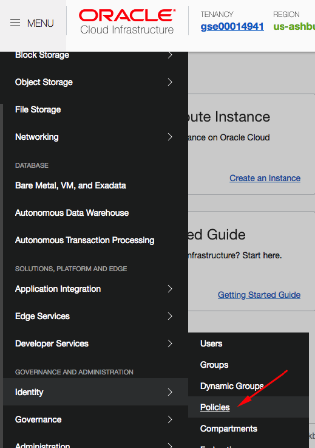
    
1. COMPARTMENT 아래 메뉴를 눌러 (root) 라고 표기된 compartment를 선택합니다.

   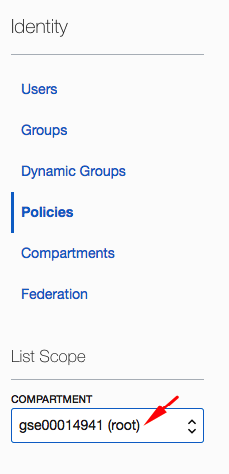

1. Create Policy 버튼을 클릭하여 새로운 Policy를 만듭니다.

   

1. NAME을 쓰고(예:oke-service) STATEMENT에 "`allow service OKE to manage all-resources in tenancy`" 라고 입력합니다.

   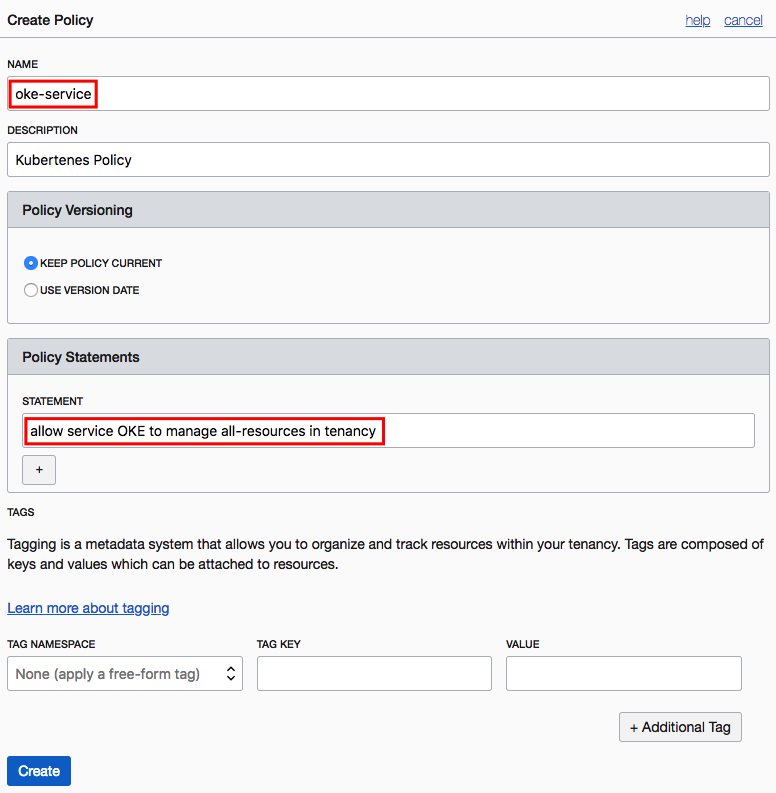

저장을 하면 Kubernetes 클러스터링을 만들 수 있는 권한이 부여가 되었습니다.

# Kubernetes Cluster 생성하기

1. OKE 관리화면으로 들어갑니다.

    **개발자 서비스 > 컨테이너 클러스터(OKE)** 를 눌러 클러스터 관리화면을 보여줍니다.

    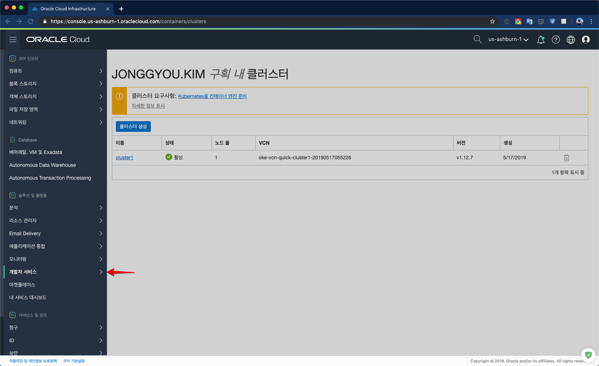

1. **클러스터 생성** 버튼을 클릭합니다.

    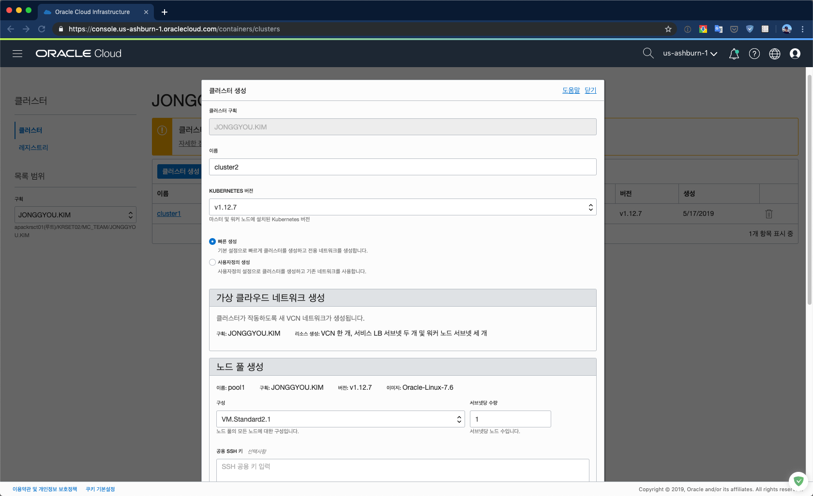

1. **생성** 을 클릭하여 클러스터를 만듭니다.

    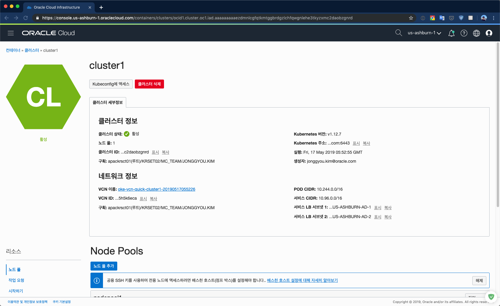

# kubeconfig 설정
1. 다음 작업을 완료했는지 확인하십시오. 위의 내용을 완료하였으면 다음 작업으로 넘어갑니다.
    - API 서명 키 쌍을 생성했습니다. 
    - API 서명 키 쌍의 공개 키 값을 사용자 이름의 사용자 설정에 추가했습니다.
    - Oracle Cloud Infrastructure CLI를 설치 및 구성했습니다.
    
    위의 작업 중 하나 이상을 수행하지 않았거나 확실하지 않은 경우, Kubernetes 설명서의 Container Engine에서 [kubeconfig 파일을 다운로드하여 클러스터 액세스를 활성화하는 방법](https://docs.cloud.oracle.com/iaas/Content/ContEng/Tasks/contengdownloadkubeconfigfile.htm) 항목을 참조하십시오.

1. 개발자 서비스 > 컨테이너 클러스터(OKE)를 선택하고, 이전에 만들었던 클러스터를 선택합니다.
    
    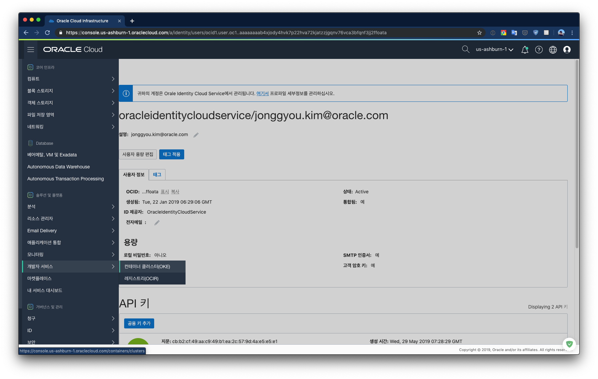

1. `Kube Cluster`에 대한 세부 정보가 표시된 클러스터 페이지에서 Access Kubeconfig를 클릭하여 Kubeconfig 액세스 방법 대화 상자를 표시합니다.

    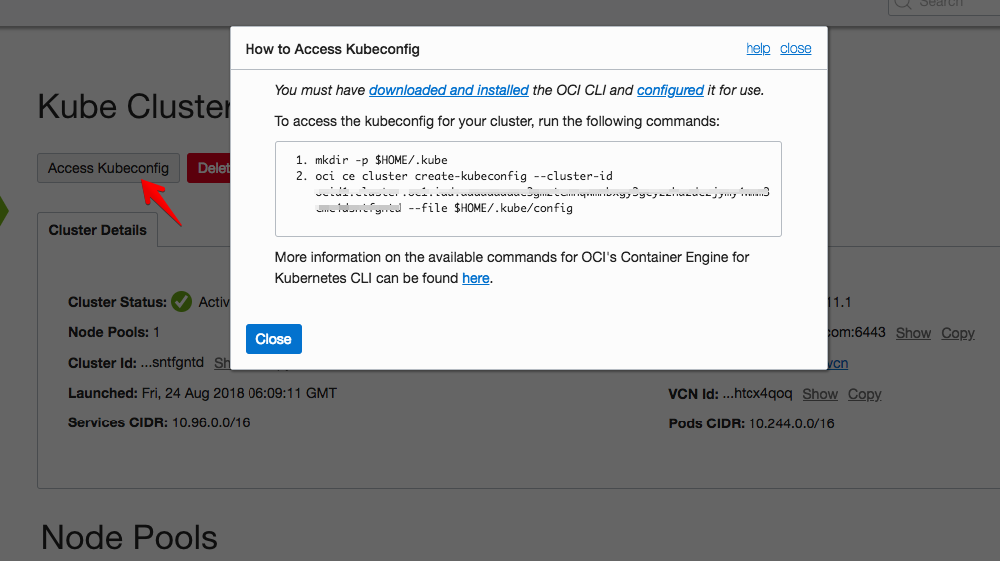

1. 화면에 나온 명령어를 복사하여 터미널에서 실행합니다. 

    ~~~sh
    $ mkdir -p $HOME/.kube
    $ oci ce cluster create-kubeconfig --cluster-id ocid1.cluster.oc1.ap-seoul-1.aaaaaaaaaftgmzbsmnswcgvr... --file $HOME/.kube/config --region ap-seoul-1 --token-version 2.0.0 
    ~~~

    그리고 token 버젼을 바꿔서 한번 더 실행합니다.
    ~~~sh
    $ oci ce cluster create-kubeconfig --cluster-id ocid1.cluster.oc1.ap-seoul-1.aaaaaaaaaftgmzbsmnswcgvr... --file $HOME/.kube/config --region ap-seoul-1 --token-version 1.0.0 
    ~~~

    여기서 `ocid1.cluster.oc1.phx.aaaaaaaaae ...`는 현재 클러스터의 OCID입니다. 편의상 Kubeconfig 액세스 방법 대화 상자의 명령에 이미 클러스터의 OCID가 포함되어 있습니다.

1. 만들어진 환경을 적용합니다.

    ~~~
    export KUBECONFIG=$HOME/.kube/config
    ~~~

1. 닫기를 클릭하여 Kubeconfig 액세스 방법 대화 상자를 닫습니다.

# kubectl 및 Kubernetes 대시 보드에 대한 클러스터 액세스 확인

1. kubectl을 이미 설치했는지 확인하십시오. 아직 수행하지 않았다면, [kubectl 문서](https://kubernetes.io/docs/tasks/tools/install-kubectl/#install-kubectl)를보십시오.

1. kubectl을 사용하여 생성 한 새 클러스터에 연결할 수 있는지 확인하십시오. 터미널 창에서 다음 명령을 입력하십시오.
    
    ~~~sh
    $ kubectl cluster-info
    ~~~
    
    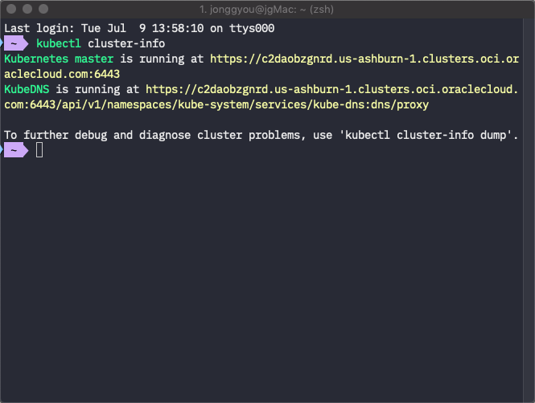
    
---
완료하셨습니다.