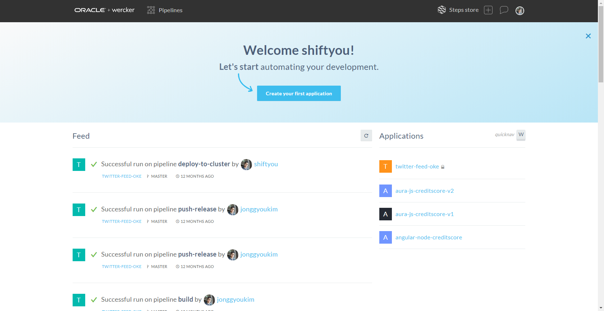
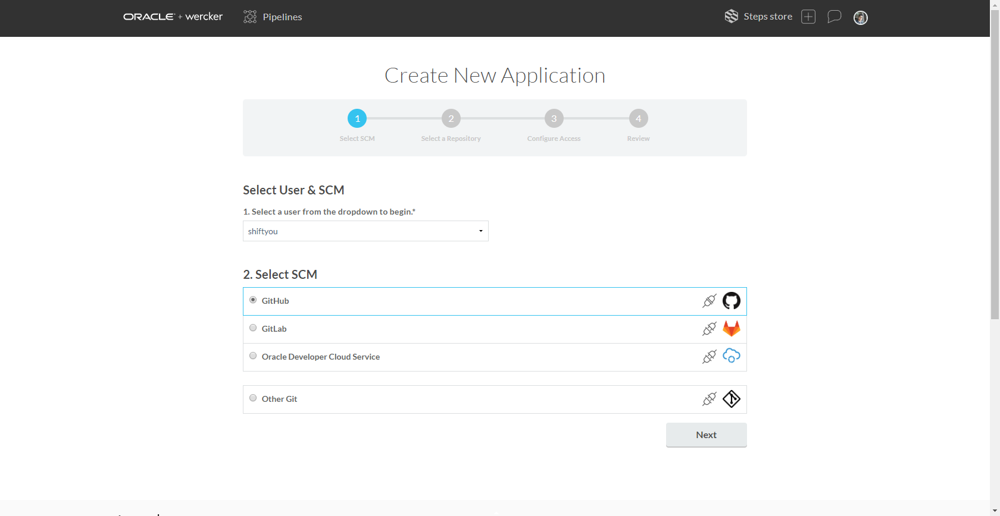
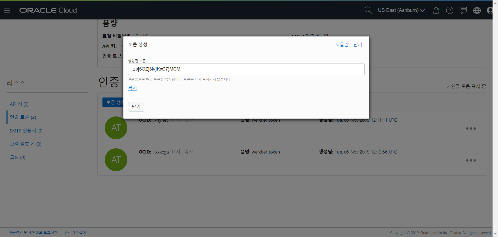
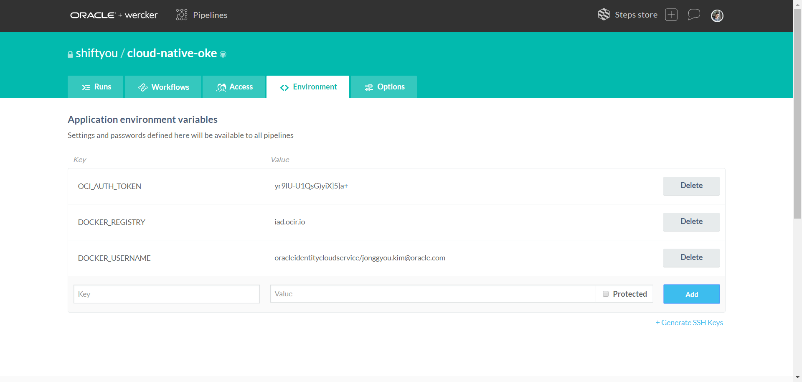
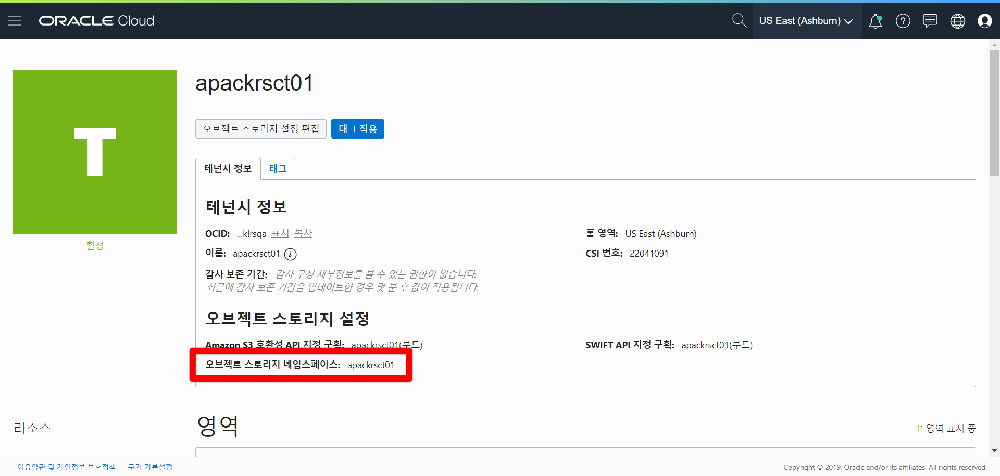
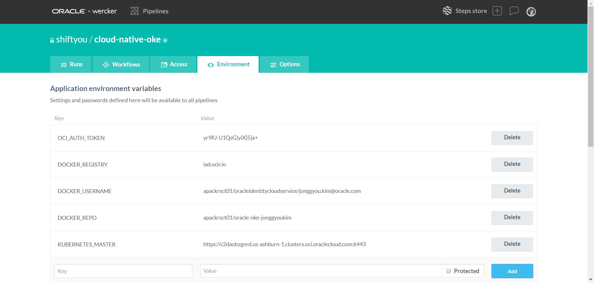
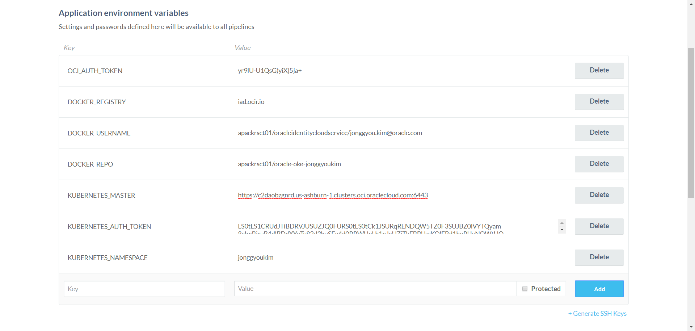

# Wercker 생성

오라클 컨테이너 기반 CI(Continuous Integration) 서비스인 Wercker를 사용하여 컨테이너 이미지 빌드, 테스트와 쿠버네티스 환경에 배포를 자동화하는 시나리오입니다.

Wercker 계정에 로그인을 합니다. 계정이 없다면 생성을 위해 app.wercker.com에 접속한 후 우측 Sign up 을 클릭합니다.

가입이 성공하면 로그인을 합니다.

Wercker에서는 하나의 Github Repository에 대응되는 단위를 애플리케이션이라 하며, Wercker 애플리케이션은 Step, Pipeline, Workflow를 포함합니다.  
먼저 Wercker 애플리케이션을 하나 생성합니다.

1. Create your first application 클릭

    

1. 좀 전에 가입한 GitHub을 선택하고 Next를 누릅니다.  
화면에서 **cloud-native-oke** 라는 이름의 repository를 선택하고 Next를 누릅니다.

    

1. SSH key는 public으로 할 것이니 기본적으로 선택된 사항으로 Next 를 누릅니다.

    

1. 전체적인 항목을 보고 "Create"를 눌러 애플리케이션을 생성합니다.

    

# 환경변수 설정

Wercker Application에서 **Oracle Container Registry** 에 컨테이너 이미지를 푸시하기 위한 설정을 합니다. 상단 탭 메뉴중에서 **Environment**를 선택합니다.

여기서 필요한 Key와 Value는 다음과 같습니다. 

1. OCI_AUTH_TOKEN
1. DOCKER_REGISTRY
1. DOCKER_USERNAME
1. DOCKER_REPO
1. KUBERNETES_MASTER
1. KUBERNETES_AUTH_TOKEN
1. KUBERNETES_NAMESPACE
    

> 여기서 KUBERNETES_MASTER와 KUBERNETES_AUTH_TOKEN은 $HOME/.kube/config (kubeconfig) 파일의 내용을 참조해서 설정합니다.

1. OCI_AUTH_TOKEN

    OCI Console 우측 상단의 사용자 아이디를 클릭 후 좌측 **Auth Tokens**를 선택한 후 **Generate Token**을 클릭합니다.
    
    
    
    DESCRIPTION에 임의로 **Wercker Token**이라고 입력한 후 **Generate Token** 버튼을 클릭합니다.

    
    
    생성된 토큰을 복사한 후 Wercker에 다음과 같이 입력하고 Add 버튼을 클릭합니다.

    - **Key:** OCI_AUTH_TOKEN  
    - **Value:** 토큰값 (예: 8K2}JTG96[d82{XXVWRq)

    
    
1. DOCKER_REGISTRY

    여기서는 애슈번(Ashburn) 리전에 있는 Registry를 사용하도록 하겠습니다.

    - **Key:** DOCKER_REGISTRY  
    - **Value:** 지역.ocir.io (예: iad.ocir.io)

    > Container Registry는 각 리전별로 존재합니다. Registry는 리전키 + ocir.io로 구성되는데, 리전키의 경우는 현재 icn(서울), nrt(도쿄), yyz(토론토), fra(프랑크푸르트), lhr(런던), iad(애쉬번), phx(피닉스)입니다. 

    
    
1. DOCKER_USERNAME

    Docker Username은 OCI 사용자 아이디입니다. OCI Console 우측 상단의 사람 아이콘을 클릭해서 확인할 수 있습니다. 

    

    여기에 Tenancy명이 필요합니다. 아래 Value는 예시이며, 보통 다음과 같이 구성됩니다.

    - **Key:** DOCKER_USERNAME  
    - **Value:** 태넌시명/아이디 (예: skimgmt/jonggyou.kim@oracle.com)

    

1. DOCKER_REPO
    
    Docker Repository이름으로 {Tenancy의 Object Storage Namespace} + {레파지토리명}입니다. 다음과 같이 레파지토리 이름을 지정합니다. Tenancy의 Object Storage는 Tenancy 정보 페이지 하단에서 확인할 수 있습니다. (일반적으로 Tenancy 이름과 같습니다.)

    
    
    >**!!! Repository는 Tenancy에서 공통으로 사용하기 때문에 각자 레파지토리 이름이 달라야 하므로, 영문 이니셜을 뒤에 붙입니다.**

    - **Key:** DOCKER_REPO  
    - **Value:** 태넌시/특정이름 (예: skimgmt/cloud-native-oke-jonggyoukim)

    

1. KUBERNETES_MASTER는 $HOME/.kube/config 파일에서 얻을 수 있습니다. 해당 파일을 편집기등으로 오픈한 후 MASTER 서버 주소를 복사 후 입력합니다.

    

    - **Key:** KUBERNETES_MASTER  
    - **Value:**: KUBERNETES SERVER MASTER URL (예: https://c2daobzgnrd.us-ashburn-1.clusters.oci.oraclecloud.com:6443)

    

1. KUBERNETES_AUTH_TOKEN도 마찬가지로 .kube/config 파일에서 얻을 수 있습니다. 해당 파일을 편집기등으로 오픈한 후 AUTH TOKEN을 복사해서 입력합니다. (한줄로 만들어야 합니다.)

    

    - **Key:** KUBERNETES_AUTH_TOKEN  
    - **Value:**: KUBERNETES AUTH TOKEN (예: LS0tLS1CRUdJTiBDRVJUSU.....)

    

1. KUBERNETES_NAMESPACE를 사용하는 이유는 동일한 서비스를 여러 사람이 동일한 노드에 배포하기 때문에 각 Pod와 Deployment, Service를 각 사용자별로 생성하기 위함입니다. Kubernetes Cluster에 Namespace를 지정하여 Pod, Service, Deployment, Secret을 분리합니다. 

    - **Key:** KUBERNETES_NAMESPACE  
    - **Value:**: 고유한 값 (예: jonggyoukim)

    

# 파이프라인 생성

CI/CD 에서 어떤 작업을 할 것인지 정의하는 것을 pipeline 이라 한다. 상위 메뉴중에 "Workflows" 항목을 클릭하여 Pipeline을 정의할 수 있다.  

이번 샘플에서 할 pipeline 은 다음의 세가지이다.
- build : 소스를 컴파일 하는 작업
- deploy : Docker image를 만들어서 Registry에 올리는 작업
- oke : OCI의 Kubernetes 에서 서비스하는 작업

기본적으로 **build** 라는 이름의 pipeline이 정의되어 있다. 이는 Yaml 설정에서 build 라는 이름으로 맵핑된다.

그래서 deploy 와 oke 라는 pipeline을 추가해 준다.  
위 화면에서 **Add new pipeline**을 클릭한다.

- **Name** : deploy
- **YML Pipeline name:** : deploy

"Create" 버튼을 눌러 완성한다.  그리고 oke 도 만든다.

- **Name** : oke
- **YML Pipeline name:** : oke

다시 화면에서 다음위치의 + 를 클릭한다.

화면 아래의 "Execute pipeline" 을 클릭하여 **deploy**를 선택하고 Add를 누른다.

그 후 deloy pipeline 옆의 + 를 눌르 oke pipeline 도 만든다.

파이프라인이 완성되었다.

# WERCKER.YML

아래는 pipeline을 구성하는 wercker.yml 파일이다.
~~~yaml
box:
 id: node:latest
 ports:
   - "8080"

# Build definition
build:
  # The steps that will be executed on build
  steps:
    - script:
        code: export NODE_ENV='testing'

    # A step that executes `npm install` command
    - npm-install

    # A custom script step, name value is used in the UI
    # and the code value contains the command that get executed
    - script:
        name: echo nodejs information
        code: |
          echo "node version $(node -v) running"
          echo "npm version $(npm -v) running"

#Push the docker image with our built and tested application to the Oracle Container Registry
deploy:
  steps:
    - internal/docker-build:
        dockerfile: Dockerfile
        image-name: oke-sample

    - internal/docker-push:
        image-name: oke-sample
        username: $DOCKER_USERNAME
        password: $OCI_AUTH_TOKEN
        registry: https://$DOCKER_REGISTRY/v2/
        repository: $DOCKER_REGISTRY/$DOCKER_REPO

#Deploy our container from the Oracle Container Registry to the Oracle Container Engine (Kubernetes)
oke:
  box:
    id: alpine
    cmd: /bin/sh

  steps:
    - bash-template

    - kubectl:
        name: create namespace
        server: $KUBERNETES_MASTER
        token: $KUBERNETES_AUTH_TOKEN
        insecure-skip-tls-verify: true
        command: create namespace ${KUBERNETES_NAMESPACE}; echo done

    - kubectl:
        name: delete secret
        server: $KUBERNETES_MASTER
        token: $KUBERNETES_AUTH_TOKEN
        insecure-skip-tls-verify: true
        command: delete secret ocirsecret --namespace=${KUBERNETES_NAMESPACE}; echo done

    - kubectl:
        name: create secret
        server: $KUBERNETES_MASTER
        token: $KUBERNETES_AUTH_TOKEN
        insecure-skip-tls-verify: true
        command: create secret docker-registry ocirsecret --docker-server=$DOCKER_REGISTRY --docker-email=nobody@oracle.com --docker-username=$DOCKER_USERNAME --docker-password='$OCI_AUTH_TOKEN' --namespace=${KUBERNETES_NAMESPACE}

    - script:
        name: "view deployment yaml"
        code: cat kube-oke-sample.yml

    - kubectl:
        name: delete oke-sample of kubernetes
        server: $KUBERNETES_MASTER
        token: $KUBERNETES_AUTH_TOKEN
        insecure-skip-tls-verify: true
        command: delete -f kube-oke-sample.yml --namespace=${KUBERNETES_NAMESPACE}

    - kubectl:
        name: deploy oke-sample to kubernetes
        server: $KUBERNETES_MASTER
        token: $KUBERNETES_AUTH_TOKEN
        insecure-skip-tls-verify: true
        command: apply -f kube-oke-sample.yml --namespace=${KUBERNETES_NAMESPACE}

    - kubectl:
        name: get all
        server: $KUBERNETES_MASTER
        token: $KUBERNETES_AUTH_TOKEN
        insecure-skip-tls-verify: true
        command: get all --namespace=${KUBERNETES_NAMESPACE}
~~~

내용은 pipeline을 구성하는 항목이며 다음의  pipeline 을 정의하고 있다.
- build

    node.js 를 수행하는 과정

- deploy

    docker image 로 만들고 registry에 deploy 하는 과정

- oke

    OKE에 해당 image를 컨테이너로 서비스하는 과정  
    >중복을 회피하기 위하여 namespace 사용합니다.

# Wercker를 통해 자동배포하기

1. 샘플 애플리케이션을 수정하기 위해서 수정할 파일에 접근한다.

    ~~~
    cd cloud-native-oke/routes
    ~~~

1. version.js 파일을 수정한다.

    ~~~
    vi version.js
    ~~~

    아래의 항목 중 1.0 을 변경하고 저장한다. (예:2.0)
    ~~~node
    var version = "1.0"; <--- 수정 
    exports.version = version;
    ~~~

1. git 에 push 한다.

    ~~~
    git add .
    git commit -m update_version
    git push
    ~~~

1. wercker 에서 자동으로 CI/CD가 동작되는 것을 확인한다.

    

1. kubectl 로 IP가 할당됨을 확인한다.

    ~~~
    $ kubectl get all -n {네임스페이스}
    NAME                              READY   STATUS    RESTARTS   AGE
    pod/oke-sample-7bdd498bd7-fqrkx   1/1     Running   0          75s

    NAME                 TYPE           CLUSTER-IP     EXTERNAL-IP   PORT(S)          AGE
    service/oke-sample   LoadBalancer   10.96.246.11   <pending>     8080:30192/TCP   75s

    NAME                         DESIRED   CURRENT   UP-TO-DATE   AVAILABLE   AGE
    deployment.apps/oke-sample   1         1         1            1           75s

    NAME                                    DESIRED   CURRENT   READY   AGE
    replicaset.apps/oke-sample-7bdd498bd7   1         1         1       75s
    ~~~

    아직 **&lt;pending&gt;** 상태이면 IP가 나올 때 까지 반복한다.

    ~~~ 
    kubectl get all -n {네임스페이스}
    NAME                              READY   STATUS    RESTARTS   AGE
    pod/oke-sample-7bdd498bd7-fqrkx   1/1     Running   0          76s

    NAME                 TYPE           CLUSTER-IP     EXTERNAL-IP      PORT(S)          AGE
    service/oke-sample   LoadBalancer   10.96.246.11   150.136.200.30   8080:30192/TCP   76s

    NAME                         DESIRED   CURRENT   UP-TO-DATE   AVAILABLE   AGE
    deployment.apps/oke-sample   1         1         1            1           76s

    NAME                                    DESIRED   CURRENT   READY   AGE
    replicaset.apps/oke-sample-7bdd498bd7   1         1         1       76s
    ~~~

1. IP를 확인하고 접속해서 버젼이 바뀌어 있는지 확인한다.

---
완료하셨습니다.
